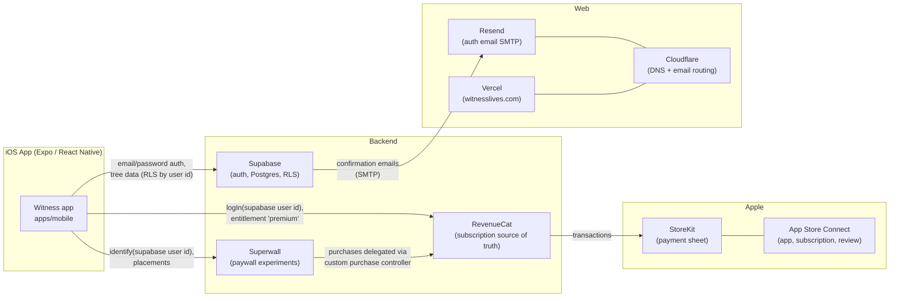

# Witness — Tech Stack & Wiring

*Last updated 2026-07-22, the day version 1.0 was submitted to App Review. Written for a developer joining the project: what each service does, how they connect, and the settings that took real effort to discover. Secrets are referenced by location, never reproduced here.*

## The big picture



The single thread that ties the services together is the **Supabase user id**: it is the RevenueCat app-user id and the Superwall identity, so a subscription follows the account across devices and reinstalls, and dashboard analytics line up across all three.

---

## Repository layout

Monorepo with npm workspaces (`packages/*`, `apps/*`); dependencies hoist to the root `node_modules`.

| Path | What it is |
|---|---|
| `apps/mobile` | The Expo app (SDK 57, React Native 0.86, expo-router ~57) |
| `packages/core` (`@witness/core`) | Shared logic: GEDCOM parsing (`extractGedcomText`, `parseGedcom`), Supabase import (`importParsedGedcom`), generated `database.types.ts`. **Exports from `dist/` — run `npm run build` in `packages/core` after touching `src/` or the app's typecheck fails with stale types.** |
| `supabase/` | Migrations (e.g. `profiles` table + signup trigger) and config; project is CLI-linked |
| `docs/preview-site/` | The public witnesslives.com site (see Website below) |
| `docs/` | This document, design specs (`witness-onboarding-screens.md`), guides |
| `apps/mobile/plugins/` | Local Expo config plugins (see build pipeline) |

## Environment files

| File | Loaded when | Notes |
|---|---|---|
| `packages/core/.env` | dev (symlinked as `apps/mobile/.env`) | Supabase URL/anon key, RevenueCat + Superwall public keys, dev conveniences |
| `apps/mobile/.env.production` | release builds (`NODE_ENV=production`) | Overrides per-var; anything missing falls through to `.env`, so a machine without `.env` builds a broken release — keep required vars mirrored here |

All app-visible vars use the `EXPO_PUBLIC_` prefix and are **inlined at bundle time** — changing them requires restarting Metro (with `--clear` to be safe), not just reloading the app.

Dev-only escape hatches (both compiled out of release builds by `__DEV__` guards):
- `EXPO_PUBLIC_DEV_AUTOLOGIN=1` + `DEV_EMAIL`/`DEV_PASSWORD` — the sign-in screen logs in automatically on mount. Because it only runs on the sign-in screen, switching accounts requires clearing the stored session (uninstall the app).
- `EXPO_PUBLIC_DEV_SKIP_PAYWALL=1` — `isEntitled` is forced true so simulators never block on store config.

---

## The mobile app

**Stack:** Expo SDK 57 (prebuild workflow — `ios/` is generated and gitignored), expo-router with `Stack.Protected` guards, Playfair Display + Inter via `@expo-google-fonts`, `react-native-maps`, `expo-notifications` for local notifications (weekly digest, trial reminder).

**The router "gauntlet"** (`src/app/_layout.tsx`): a signed-in user walks, in order — onboarding narrative (once per account, tracked server-side in `profiles.onboarding_completed_at`) → hard paywall (every launch until entitled) → the app. Guards key off three providers: `SessionProvider` (Supabase session), `ProfileProvider` (onboarding flag), `PurchasesProvider` (entitlement).

**Loading gate hard-won lesson:** the router gates the whole UI on `isPurchasesLoading`, and `Purchases.getCustomerInfo()` can hang indefinitely behind StoreKit's first-launch queries on a fresh install. `PurchasesProvider` therefore caps the initial load at 5 s and fails closed (paywall still gates; the customer-info listener updates entitlement whenever StoreKit answers). Similarly, `Purchases.logOut()` rejects *by design* when RevenueCat is already anonymous (the normal signed-out state) — it must be caught.

**GEDCOM file handling:** `app.json → ios.infoPlist` declares `UTImportedTypeDeclarations` (custom UTIs for `.ged`/`.gdz`) + `CFBundleDocumentTypes` + `LSSupportsOpeningDocumentsInPlace: false` (Witness imports a copy; Apple's uploader requires the key either way). The OS hand-off flow: Share Sheet/Files "Open in Witness" → `+native-intent.ts` stashes the `file://` URI in AsyncStorage (`lib/pending-import.ts`) → the root layout consumes it once session + onboarding + entitlement are all satisfied → routes to `/import?fileUri=…` which parses immediately, skipping the document picker.

## Build & release pipeline

```
app.json (bump ios.buildNumber)
  → npx expo prebuild -p ios --no-install     # regenerates ios/, wipes the Pods workspace
  → cd ios && pod install                     # MUST run with LANG=en_US.UTF-8 LC_ALL=en_US.UTF-8
  → xcodebuild -workspace ios/Witness.xcworkspace -scheme Witness -configuration Release \
      -destination 'generic/platform=iOS' -archivePath <path>.xcarchive archive -allowProvisioningUpdates
  → xcodebuild -exportArchive (method app-store-connect, automatic signing, team SLD65K94V7)
  → xcrun altool --upload-app -f <ipa> -t ios --apiKey 3L6KTSQN4U --apiIssuer <issuer id>
```

Gotchas encoded in the repo:
- **CocoaPods on Ruby 4 crashes without a UTF-8 locale** ("Unicode Normalization not appropriate for ASCII-8BIT"). Always prefix pod/xcodebuild commands with `LANG=en_US.UTF-8 LC_ALL=en_US.UTF-8`.
- **Prebuild once silently dropped the GEDCOM registration** from the generated Info.plist (after a prebuild whose pod install crashed midway). Since `ios/` is gitignored the loss was invisible. `plugins/with-gedcom-guard.js` (registered in `app.json → plugins`) injects an Xcode build phase that fails any build whose product Info.plist lacks `CFBundleDocumentTypes` — the regression now breaks the build loudly.
- Build numbers are global per app in ASC; builds 1–3 (Jul 5–6) were pre-paywall, build 5 is the submitted one. Always bump past the highest ASC build.

**App Store Connect API automation:** key id `3L6KTSQN4U`, issuer `427db4cd-26c0-4ced-9018-afc702a28277`, private key at `~/.appstoreconnect/private_keys/AuthKey_3L6KTSQN4U.p8` (never committed). JWTs must expire ≤ 20 minutes out or Apple rejects them. This key can read/patch nearly all metadata (subscription localizations, intro offers, privacy URL, category, review details, build attachment) — but **cannot** create/cancel review submissions, add subscription items to submissions, or answer the App Privacy questionnaire (UI-only, Admin role).

## Supabase (project `bdjsahbjptpcmouqozvs`, us-east-1)

- **Auth:** email/password with confirmation required. `site_url = https://witnesslives.com/` (where confirmation links land — the homepage carries a "just confirmed?" note). SMTP is **Resend** (`smtp.resend.com:465`, user `resend`, password = a Resend API key stored only in Supabase auth config), sender **"Witness <hello@witnesslives.com>"**, rate limit raised to **100 emails/hour** (the built-in mailer's 2/hour cap stranded signups — this bit us on submission day).
- **Data:** `profiles` (one row per user via signup trigger; `onboarding_completed_at` drives the router), trees/individuals/events/places from GEDCOM import. RLS scopes everything to the owning user; the app uses the anon key + user JWT.
- **Admin access:** the Supabase CLI on the dev Mac is logged in (token in macOS keychain, item "Supabase CLI") and linked to the project; `supabase projects api-keys` yields the service-role key for admin tasks (creating pre-confirmed accounts, resetting onboarding flags). The management API (`api.supabase.com/v1/projects/<ref>/config/auth`) is how SMTP/rate-limit settings were changed.

## RevenueCat

- Public iOS SDK key `appl_…` in env (safe to embed). **Never ship a `test_…` key in a release build** — the SDK deliberately hard-crashes device Release builds configured with one (simulator is exempt, so sim testing won't catch it). `purchases.tsx` guards: a test key outside `__DEV__` is treated as missing → configure skipped → paywall fails closed.
- **Entitlement:** `premium` (also `EXPO_PUBLIC_REVENUECAT_ENTITLEMENT_ID`). A stale duplicate entitlement "Witness Pro" existed and was deactivated 2026-07-22 — `premium` is the only one attached to the product.
- **Offering:** `default` with package `$rc_annual` → product `com.yourname.witnesslives.annual` ($19.99/yr). The paywall reads `offering?.annual`. (The `com.yourname` in the product id is an unrenamable template leftover; customers never see it.)
- Identity: `Purchases.logIn(supabaseUserId)` on session change. Note RevenueCat *transfers* a store subscription to the currently-logged-in app user when the same Apple ID purchases/restores under a new account — expected, but it surprises you in sandbox testing.

## Superwall

- Public key `pk_…` in env. Mounted via `SuperwallGate` *inside* `PurchasesProvider` (RevenueCat must configure first — documented order). Without a key the app renders unchanged, and without dashboard config every placement no-ops — **Superwall is an optional experiment layer; the built-in hard paywall is always the fallback.**
- A `CustomPurchaseControllerProvider` delegates every Superwall purchase/restore to RevenueCat, which stays the single source of truth for entitlement.
- Placements: `onboarding_complete` (fired with the persona chosen during onboarding as a param, so dashboard audiences can segment) and `feature_locked` (premium feature gate).
- Identity + subscription status are mirrored to Superwall from the Supabase user id and RevenueCat customer info (`SuperwallBridge`), but only after `SuperwallLoaded` — calls made before configure finishes reject.

## App Store Connect (app 6786499130, "WitnessLives", SKU Witness001)

- Subscription group **"WitnessLives Premium"** (21250567 → group localization "WitnessLives Annual Subscription") containing **"Annual - $19.99"** (6792833280): customer-facing name **"Witness Premium"**, 1-year period, $19.99, **7-day free-trial intro offer in all 175 territories with no end date** (was USA+CAN with an end date — recreated 2026-07-22).
- Review details: contact on file; demo account `bicentenial1776+applereview@gmail.com` (password in ASC review details), pre-seeded with a sample tree; reviewer notes explain the login requirement, sandbox trial, and GEDCOM share-sheet testing. **Keep this account alive while in review.**
- Sandbox tester: `bicentenial1776@gmail.com` (USA). Sandbox compresses a 1-week trial to minutes, so the Day-5 trial-reminder notification can *never* fire in sandbox (its fire date is already past — by design, not a bug).
- Submission mechanics that cost us hours: a first subscription must be added to a review submission **from its own page's "Submit for Review" button**, and the **subscription group needs the same, separately** — the version-page draft drawer has no add control. Items cannot be added to an already-submitted submission; remove from review, restage, resubmit.

## Website — witnesslives.com

- **Hosting:** Vercel, project `witnesslives`, team `notata`. **Not git-integrated** — deploys are CLI-only and ship the *current working tree*: `npx vercel deploy --prod --yes --archive=tgz` (the archive flag is required; the repo exceeds Vercel's 15k file limit). **Check out `main` before deploying.**
- **Content:** `docs/preview-site/index.html` (the former invitation preview — its client-side password gate was retired in July 2026 and the page now starts unlocked; the README in that folder describing the gate is historical). `vercel.json` rewrites: `/` → the page, `/assets/*` + `/support.js` + `/image-slot.js` → its relative assets, `/privacy` and `/terms` → their pages.
- `/privacy` and `/terms` are load-bearing: the App Store listing's privacy-policy and support URLs point at this domain, and the in-app paywall links both pages. **Apple requires them to resolve.**
- **DNS + inbound email:** Cloudflare. Email routing forwards `rufus@witnesslives.com` → Gmail. Resend's outbound-sending records (MX/TXT on `send.witnesslives.com`, DKIM at `resend._domainkey`) were added by Resend's Cloudflare auto-configure and coexist with the routing records.

## Email — Resend

Domain `witnesslives.com` verified (via Cloudflare auto-config). One API key (`supabase-auth`, sending-only) lives in the Supabase auth SMTP config. Free tier: 3,000 emails/month, 100/day — revisit if signups exceed that. Anything `@witnesslives.com` can be a sender; auth emails use `hello@`.

## Credentials inventory (locations only — nothing here is a secret)

| Credential | Lives at |
|---|---|
| Supabase URL + anon key, RevenueCat public key, Superwall public key | `packages/core/.env` (gitignored), mirrored in `apps/mobile/.env.production` |
| Supabase CLI token (→ service-role key on demand) | macOS keychain, "Supabase CLI" |
| ASC API private key | `~/.appstoreconnect/private_keys/AuthKey_3L6KTSQN4U.p8` |
| Resend API key | Supabase auth SMTP config (and the Resend dashboard) |
| Vercel CLI token | `~/Library/Application Support/com.vercel.cli/auth.json` |
| Test/demo account passwords | ASC review details (demo account); dev accounts in `.env` |
| Apple signing | Automatic signing, team `SLD65K94V7` |

## Known post-launch items

- Refresh App Store screenshots (current set predates the shipped UI).
- Resend free tier is fine for launch; watch the 100/day ceiling as signups grow.
- The Supabase confirmation email template is default-styled — worth branding.
- The preview-site README (`docs/preview-site/README.md`) predates the gate removal; treat this document as current.
